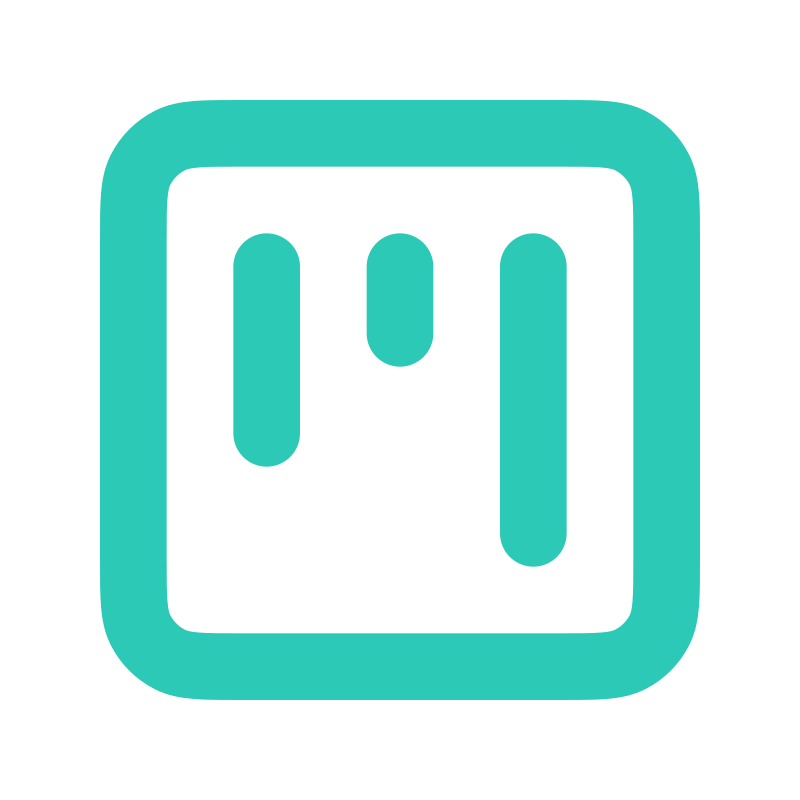

<div align="center">
  
  <h1>KanbanFlow</h1>
  <p>
    <strong>A modern, open-source Kanban board to streamline your workflow.</strong>
  </p>
  <p>
    Built with Next.js, Firebase, and Tailwind CSS for a seamless project management experience.
  </p>
  <br />
    
    
    
    
</div>

---

## ✨ Key Features

KanbanFlow is packed with features designed to make project management intuitive and collaborative.

| Feature                 | Description                                                                                               | Status |
| ----------------------- | --------------------------------------------------------------------------------------------------------- | :----: |
| **Project Management**  | Create, edit, and delete projects with ease.                                                              |   ✅   |
| **Task Organization**   | Add, update, and delete tasks within columns.                                                             |   ✅   |
| **Drag & Drop**         | Intuitively move tasks between columns and reorder columns on your board.                                 |   ✅   |
| **Sub-tasks**           | Break down complex tasks into smaller, manageable sub-tasks.                                              |   ✅   |
| **Task Deadlines**      | Set deadlines for tasks to keep your projects on track.                                                   |   ✅   |
| **Task Priorities**     | Assign priorities (Urgent, High, Medium, Low) to focus on what matters most.                              |   ✅   |
| **User Collaboration**  | Invite members to your projects via email for seamless teamwork.                                          |   ✅   |
| **Task Assignment**     | Assign tasks to specific project members.                                                                 |   ✅   |
| **User Authentication** | Secure Google Authentication to protect your projects.                                                    |   ✅   |
| **Responsive Design**   | A fully responsive UI that works beautifully on desktop and mobile devices.                               |   ✅   |
| **Toast Notifications** | Get instant feedback for your actions with clean, modern toast alerts.                                    |   ✅   |
| **Dark Mode**           | A beautiful dark mode for comfortable viewing in low-light conditions.                                    |   ✅   |
| **State Persistence**   | Your session is cached, so refreshing the page won't log you out or lose your place.                      |   ✅   |

---

## 🛠 Tech Stack

### Core Technologies

-   **[Next.js](https://nextjs.org/)**: The React framework for building fast, server-rendered applications.
-   **[React](https://react.dev/)**: A JavaScript library for building user interfaces.
-   **[Firebase](https://firebase.google.com/)**: Provides backend services, including Authentication and Firestore Database.
-   **[Tailwind CSS](https://tailwindcss.com/)**: A utility-first CSS framework for rapid UI development.
-   **[TypeScript](https://www.typescriptlang.org/)**: A statically typed superset of JavaScript that enhances code quality.

### UI & Components

-   **[ShadCN/UI](https://ui.shadcn.com/)**: A collection of beautifully designed, reusable components.
-   **[Lucide React](https://lucide.dev/)**: A clean and consistent icon toolkit.
-   **[Framer Motion](https://www.framer.com/motion/)**: Powers the smooth animations across the app.

---

## 🏁 Getting Started

To get a local copy up and running, follow these simple steps.

### Prerequisites

-   Node.js (v18 or later)
-   npm or yarn

### Installation

1.  **Clone the repository**
    ```bash
    git clone https://github.com/listerineh/open-kanban-board.git
    cd open-kanban-board
    ```

2.  **Install dependencies**
    ```bash
    npm install
    ```

3.  **Set up environment variables**
    -   Create a `.env` file in the root of your project.
    -   Add your Firebase project configuration to this file. You can get these from the Firebase console.
    ```env
    NEXT_PUBLIC_FIREBASE_API_KEY=your_api_key
    NEXT_PUBLIC_FIREBASE_AUTH_DOMAIN=your_auth_domain
    NEXT_PUBLIC_FIREBASE_PROJECT_ID=your_project_id
    NEXT_PUBLIC_FIREBASE_STORAGE_BUCKET=your_storage_bucket
    NEXT_PUBLIC_FIREBASE_MESSAGING_SENDER_ID=your_sender_id
    NEXT_PUBLIC_FIREBASE_APP_ID=your_app_id
    NEXT_PUBLIC_FIREBASE_MEASUREMENT_ID=your_measurement_id
    ```

4.  **Run the development server**
    ```bash
    npm run dev
    ```
    Open [http://localhost:9002](http://localhost:9002) with your browser to see the result.

---

## 📝 License

This project is licensed under the MIT License. See the [LICENSE](LICENSE) file for details.
